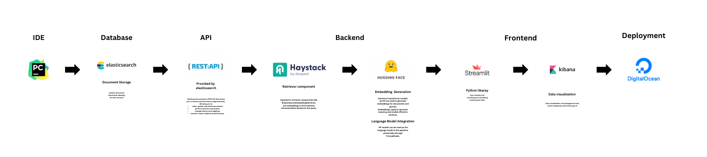

# Internal Knowledge Base Search 
## Goal:

Implement a search system that allows employees to quickly find information within a company’s knowledge base. This is helpful for large volumes of local text data to work with in order to find more centered, targeted answers. For example, a collection of books, documents, and (potentially) videos that you want to be able to interact with using AI. 

## Features:

- Advanced search capabilities with natural language queries.
- retrieval-augmented generation (RAG) - Question-answering functionality to provide direct answers from text without hallucinations
- Filtering and sorting options to refine search results.
- Highlighting exact portions of the document where the answer is found to improve user experience
- Summarizing documents

## Fullstack Architecture 
